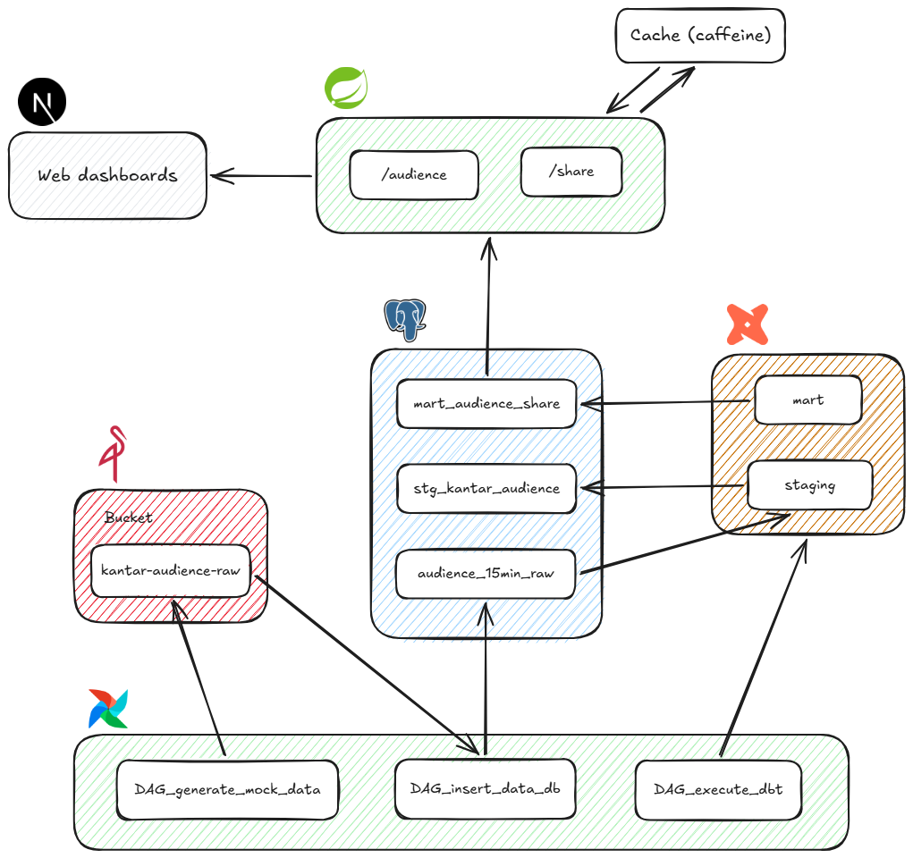

# Kantar Audience

Pipeline de dados de audiência inspirado em uma tabela da Kantar IBOPE. Gera dados de audiência em CSVs, os transforma em camadas analíticas via dbt e os expõe através de uma API com cache, consumida por um dashboard web.

## Arquitetura



### Fluxo

1. **`DAG_generate_mock_data`** gera dados fake de audiência e grava os arquivos brutos no bucket (MinIO), em `kantar_ibope_raw`
2. **`DAG_insert_data_db`** lê os arquivos do bucket e insere na tabela de dados brutos do Postgres, `audience_15min_raw`
3. **`DAG_execute_dbt`** dispara as transformações do **dbt**:
   - `staging` → `stg_kantar_audience`: limpeza e tipagem dos dados brutos
   - `mart` → `mart_audience_share`: agregações para share de audiência
4. A **API (Spring Boot)** expõe diversos endpoints. Todos passam por services com cache (Caffeine), reduzindo consultas repetidas ao banco
5. O **frontend (Next.js)** consome a API e exibe os dashboards

## Stack

| Camada | Tecnologia |
|---|---|
| Orquestração | Apache Airflow 3.2 |
| Storage bruto | MinIO |
| Banco de dados | PostgreSQL 16 |
| Transformação | dbt (via [Cosmos](https://astronomer.github.io/astronomer-cosmos/)) |
| API | Spring Boot |
| Cache | Caffeine |
| Frontend | Next.js |

## Estrutura do repositório

```text
.
├── docker-compose.yaml
├── Dockerfile                    # imagem do Airflow
├── requirements.txt
│
├── dags/
│   ├── DAG_generate_mock_data.py
│   ├── DAG_insert_data_db.py
│   └── DAG_execute_dbt.py
│
├── dbt/
│   └── kantar_audience/
│       ├── dbt_project.yml
│       ├── profiles.yml
│       └── models/
│           ├── staging/
│           │   └── stg_kantar_audience.sql
│           └── marts/
│               └── mart_audience_share.sql
│
├── backend/                       # Spring Boot
│   └── Dockerfile
│
├── frontend/                      # Next.js
│   └── Dockerfile
│
└── postgres/
    └── init.sql                   # cria o banco, usuário e tabelas iniciais
```

## Como executar

### Pré-requisitos

- Docker e Docker Compose

### Subindo o ambiente

```bash
docker compose up -d
```

Isso builda e sobe todos os serviços: Postgres, MinIO, Airflow, backend e frontend.

### Rodando o pipeline

Se não quiser esperar a execução diária, acesse o Airflow em `http://localhost:8080` (login: `airflow` / senha: `airflow`) e execute a DAG `generate_mock_data`, que dispara as outras DAGs em sequência.

## URLs dos serviços

| Serviço | URL | Login |
|---|---|---|
| Airflow UI | http://localhost:8080 | login e senha: `airflow` |
| Frontend (dashboards) | http://localhost:3000 |  |
| Backend (API) | http://localhost:8081 |  |
| MinIO Console | http://localhost:9001 | login e senha: `minioadmin` |
| Postgres | localhost:5432 | user: `analytics` |

## Campos alteráveis

Praticamente todo o projeto já tem valores padrão. Caso queira customizar, basta editar o `docker-compose.yaml` ou criar um arquivo `.env`.

### Postgres

O `init.sql` cria a tabela `process_log`, que controla o período inicial de geração de dados. Para aumentar ou diminuir esse período, basta alterar o `end_date` dos INSERTs no arquivo.

## Preview

<video src="./anexos/preview.mp4" controls width="100%"></video>