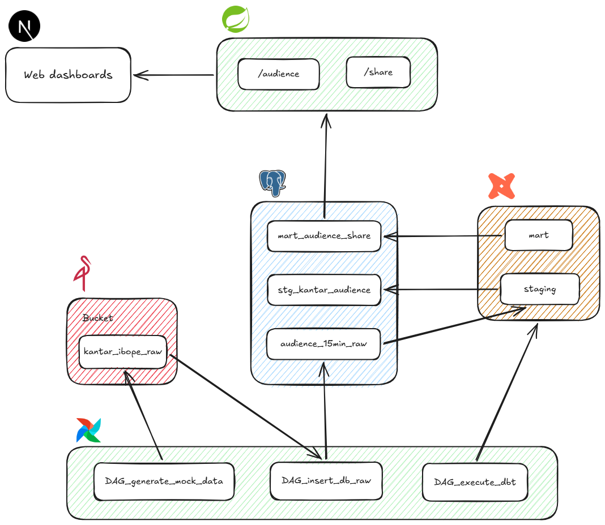

# Kantar/Ibope Audience Pipeline

Pipeline de dados de audiência baseada em uma tabela da Kantar IBOPER, que ingera dados brutos, os transforma em camadas analíticas e os expõe via API para dashboards web.

## Arquitetura

O projeto segue uma arquitetura em camadas (raw → staging → mart), orquestrada pelo Airflow e transformada pelo dbt:

1. **Airflow** orquestra três DAGs principais:
   - `DAG_generate_data` — gera/coleta os dados de audiência e grava no bucket de uma banco de objetos
   - `DAG_insert_db` — lê os arquivos do bucket e insere na camada raw do Postgres (`audience_15min_raw`, `kantar_ibope_raw`)
   - `DAG_execute_dbt` — dispara as transformações dbt (staging → mart)
2. **Bucket (object storage)** guarda os dados brutos antes de irem para o banco
3. **Postgres** armazena as camadas raw, staging (`stg_kantar_audience`) e mart (`mart_audience_share`)
4. **dbt** transforma os dados: raw → staging (limpeza/tipagem) → mart (agregações de negócio)
5. **API (Spring Boot)** expõe os dados do mart para consumo externo
6. **Web dashboards (Next.js)** consomem a API e exibem os dados de audiência

## Stack

| Camada            | Tecnologia    |
|-------------------|---------------|
| Orquestração       | Apache Airflow |
| Storage bruto      | MinIO / S3     |
| Banco de dados      | PostgreSQL     |
| Transformação       | dbt            |
| API                 | Spring Boot    |
| Frontend            | Next.js        |
